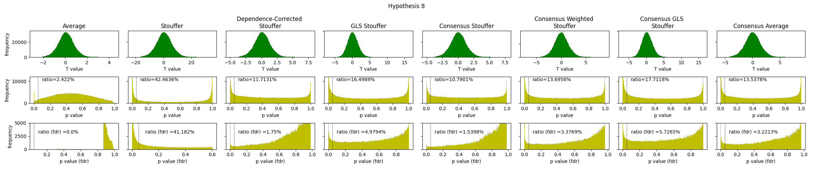

### Code for reproducing the key results of our paper:  _Systematic review and evaluation of meta-analysis methods for pipeline comparison_

Lefort-Besnard J, Nichols T, Maumet C

Please cite this paper when using the code for your research.
You can clone this repository by:
git clone https://github.com/JLefortBesnard/SDMA.git

---

### MA outputs in generated data

#### Generated data

&nbsp;

#### PP plots

&nbsp;

---

&nbsp;
### MA outputs in NARPS data

#### frequency

&nbsp;
#### brain maps

&nbsp;

---

&nbsp;
### Testing Q assumptions

#### Frobenius scores

"width:100%;"/>

&nbsp;

#### Similarity

